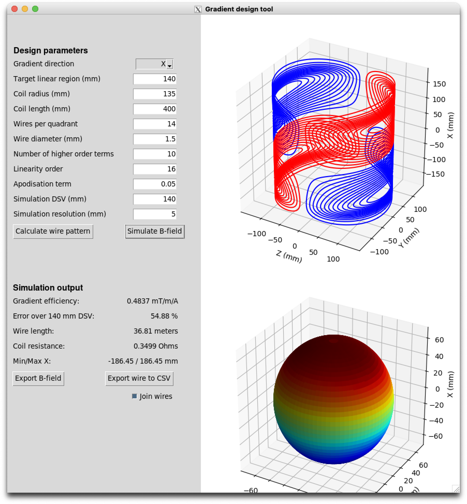

# GradientDesignTool


A design tool for creating gradient coils for Halbach array based MRI systems based on the Target Field Method initially proposed by Turner.

Run gradientDesignTool.py to load the GUI. 

```bash
$ git clone --depth 1 https://github.com/LUMC-LowFieldMRI/GradientDesignTool
$ cd GradientDesignTool
$ python -m venv venv
$ source venv/bin/activate
$ pip install -r requirements.txt
$ python ./gradientDesignTool.py
```

Note; The tool is fully functional but still in an early beta version and can be unstable. A known issue is that the outer-most wires can be open, this will cause problems in simulating the gradient fields and will cause the wire export to be stuck in a permanent loop. Tweaking the parameters can eliminate the open wires (setting the number of higher order modes to 0 seems to work well).


